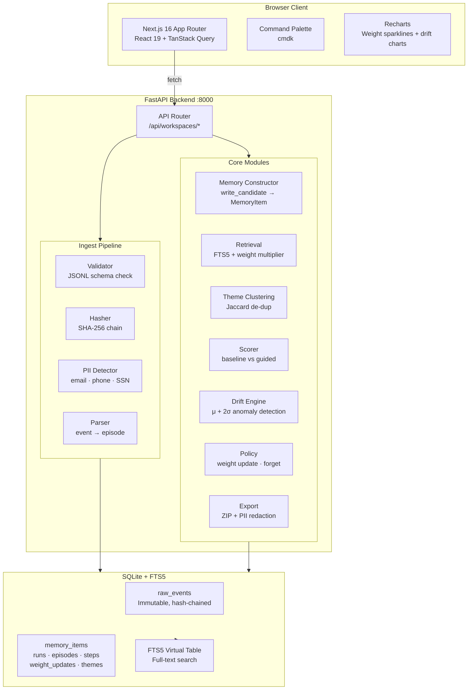
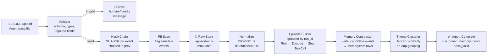
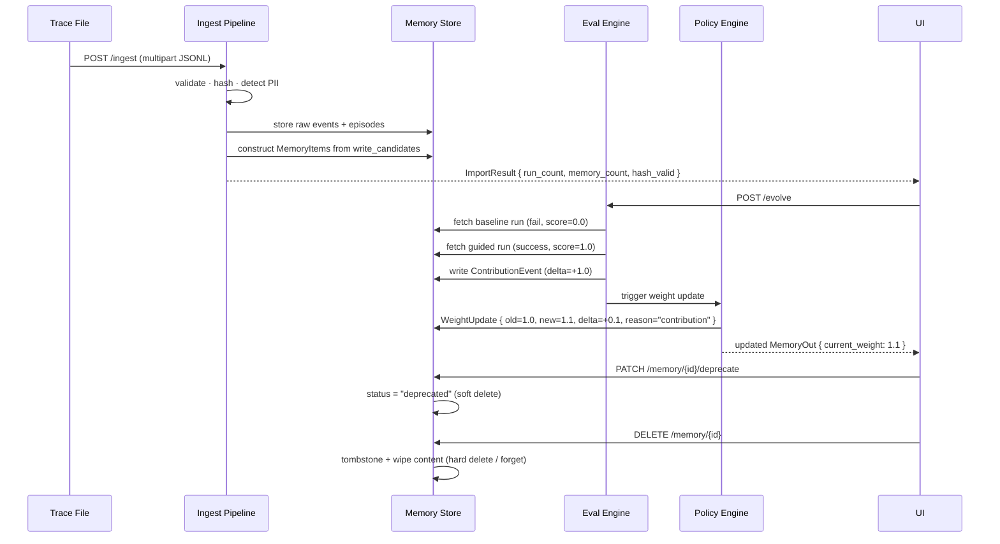

<div align="center">

```
███╗   ███╗███████╗████████╗ █████╗ ███╗   ███╗███████╗███╗   ███╗ ██████╗ ██████╗ ██╗   ██╗
████╗ ████║██╔════╝╚══██╔══╝██╔══██╗████╗ ████║██╔════╝████╗ ████║██╔═══██╗██╔══██╗╚██╗ ██╔╝
██╔████╔██║█████╗     ██║   ███████║██╔████╔██║█████╗  ██╔████╔██║██║   ██║██████╔╝ ╚████╔╝
██║╚██╔╝██║██╔══╝     ██║   ██╔══██║██║╚██╔╝██║██╔══╝  ██║╚██╔╝██║██║   ██║██╔══██╗  ╚██╔╝
██║ ╚═╝ ██║███████╗   ██║   ██║  ██║██║ ╚═╝ ██║███████╗██║ ╚═╝ ██║╚██████╔╝██║  ██║   ██║
╚═╝     ╚═╝╚══════╝   ╚═╝   ╚═╝  ╚═╝╚═╝     ╚═╝╚══════╝╚═╝     ╚═╝ ╚═════╝ ╚═╝  ╚═╝   ╚═╝

███████╗████████╗██╗   ██╗██████╗ ██╗ ██████╗
██╔════╝╚══██╔══╝██║   ██║██╔══██╗██║██╔═══██╗
███████╗   ██║   ██║   ██║██║  ██║██║██║   ██║
╚════██║   ██║   ██║   ██║██║  ██║██║██║   ██║
███████║   ██║   ╚██████╔╝██████╔╝██║╚██████╔╝
╚══════╝   ╚═╝    ╚═════╝ ╚═════╝ ╚═╝ ╚═════╝
```

**The memory control plane for agentic systems.**
*Inspect, evolve, and govern what your agents remember — in under 60 seconds.*

---


</div>

---

## What Is This?

Your AI agents have a memory problem. Not in the sense that they forget — in the sense that **you have no idea whether their memory is helping or hurting.** Stale experiences get retrieved. Useful lessons decay. Tool calls silently drift. And when something goes wrong, there's no audit trail.

**MetaMemory Studio** is a full-stack observability and governance platform that sits between your agent runs and your memory store. It answers four questions:

| Question | Where You Find It |
|---|---|
| *What exactly did my agent do?* | Tamper-evident run timeline with every tool call, retry, and outcome |
| *Which memories were used — and were they helpful?* | Contribution compare: baseline vs. memory-guided, scored side-by-side |
| *Which memories have drifted or gone stale?* | Drift detection dashboard with statistical anomaly scores |
| *Is it safe to delete this memory?* | Weight history graph + retrieval event log per memory item |

It is **not** a runtime memory controller (that's a future concern). It's a post-hoc analysis and policy evolution tool — the **debugger and auditor** for your agent's memory layer.

---

## The Problem in Plain Language

Imagine you built a travel booking agent. On Monday it works perfectly. By Friday it keeps trying to apply airline preferences *after* it already committed to a flight. You check your vector store — the memories look fine. You check your logs — the tool calls look normal. You have no idea what changed.

The agent learned something wrong, or it learned something right but it decayed, or it never properly attributed *why* the Monday run succeeded. **You have no way to know.**

This is the meta-memory problem: **agents that can remember facts but cannot reflect on their own remembering.**

MetaMemory Studio solves this with a two-layer architecture:

```
┌─────────────────────────────────────────────────────────────┐
│              RAW TRACE STORE  (Immutable)                   │
│                                                             │
│  Every JSONL event, append-only, SHA-256 hash-chained.      │
│  Tamper detection: one bit flip → chain verification fails. │
└─────────────────────────────────────────────────────────────┘
                            │
                     parse + extract
                            │
                            ▼
┌─────────────────────────────────────────────────────────────┐
│              DERIVED MEMORY LAYER  (Mutable)                │
│                                                             │
│  Episodes · Steps · Tool Calls · Outcomes                   │
│  Memory Items (experiences + guidelines)                    │
│  Weight Updates · Retrieval Events · Contributions          │
│  Themes (hierarchical de-dup)                               │
└─────────────────────────────────────────────────────────────┘
```

Every mutation in the derived layer is **logged as a policy event** — you can always reconstruct what happened, why a memory was reinforced, and when it was forgotten.

---

## Features

### 🔍 Run Timeline
Expand any run into a vertical timeline of typed events: `user_message`, `tool_call`, `tool_result`, `assistant_message`, `memory_retrieval`, `memory_write_candidate`. Each node is expandable with the full JSON payload. Memory events link directly to the relevant memory card.

### ⚡ Contribution Compare
Every `evolve` operation compares a **baseline run** (no memory) against a **memory-guided run** and computes a delta score. The result is a side-by-side diff viewer with a color-coded delta ribbon. Green means memory helped. Red means it hurt.

### 🧠 Memory Library
A searchable, filterable grid of all memory items in the workspace. Each card shows:
- Memory title, type, and current weight
- A sparkline of weight evolution over time
- Quick actions: pin, deprecate, or hard-delete (forget)

### 🗂️ Hierarchical Theme Grouping
Toggle the memory library into **theme-grouped view**. Similar memories are clustered by Jaccard similarity and displayed in collapsible sections. De-duplicated memories show a badge. Retrieval returns the best memory per theme — eliminating redundant context.

### 📡 Drift Detection
Statistical anomaly detection across all runs in a workspace. For each tool, computes mean + standard deviation of call frequency. Flags any run where usage exceeds **mean + 2σ**. Results are ranked by anomaly score with links to affected runs.

### 📦 Memory Review Pack Export
One-click export of a ZIP containing:
- `summary.md` — workspace stats, top helpful/harmful memories
- `memories.json` — all memory items with PII redacted (email, phone, SSN stripped)
- `weight_history.json` — full audit trail of every weight change

### 🔐 Tamper-Evident Audit
Every raw event is SHA-256 hash-chained. The `VERIFIED` badge appears on any run where the hash chain passes. Modify a single byte in your trace file and the chain fails.

### 🔒 PII Governance
Regex-based PII detection (email, phone, SSN) at ingest. PII-flagged events are tagged but not blocked. Export redacts PII automatically. Soft-delete and hard-delete (tombstone + content wipe) for GDPR compliance.

### ⌨️ Keyboard-First Navigation
- Press `/` anywhere to open the command palette
- `g r` → jump to runs
- `g m` → jump to memory library
- `f` → focus search

---

## Architecture

### System Overview



### Ingest Pipeline



### Memory Lifecycle



---

## Quickstart

> **Import your first trace and get insight in under 60 seconds.**

### Prerequisites

- Python 3.11+ with [uv](https://docs.astral.sh/uv/)
- Node.js 20+ with [pnpm](https://pnpm.io/)

### 1 — Clone and enter

```bash
git clone https://github.com/your-org/metamemory-studio
cd "metamemory-studio"
```

### 2 — Configure environment

```bash
cp .env.example .env
# Edit .env if you want a custom database path or to disable features
```

Default `.env` values:
```env
DATABASE_URL=sqlite:///./metamemory.db
ENABLE_MEMORY_CONSTRUCTION=true
ENABLE_EVOLUTION=true
CORS_ORIGINS=http://localhost:3000
```

### 3 — Start the dev servers

```bash
make dev
```

This starts:
- **Backend** at `http://localhost:8000` (FastAPI + Uvicorn, hot-reload)
- **Frontend** at `http://localhost:3000` (Next.js, hot-reload)

### 4 — Load the demo trace

In a separate terminal:

```bash
make demo
```

This:
1. Creates a workspace called **Demo**
2. Uploads `examples/sample_traces/demo_runs.jsonl` (a realistic travel-booking agent trace)
3. Runs `evolve` to score contributions and update memory weights

### 5 — Open the UI

Navigate to **http://localhost:3000** and select the **Demo** workspace.

You'll see:
- **2 runs** — one where the agent failed (AIRLINE_MISMATCH), one where it succeeded using the learned memory
- **3 memory items** — including *"Apply airline preference before booking"*
- **1 contribution event** — memory-guided run scored +1.0 over baseline
- **Weight update** — the helpful memory reinforced to 1.1

---

## Demo Trace Walkthrough

The sample trace tells the story of an agent learning from failure:

```
Run 001 — FAIL
  user: "Book me a flight to SF, aisle seat, under $500. I prefer United."
  agent: search_flights(to=SFO, seat=aisle, max_price=500)
  agent: book_flight(option_id=F1)   ← F1 is Delta, not United
  error: AIRLINE_MISMATCH
  lesson: "Apply airline preference at search time, not booking time."
  → MemoryItem created: "Apply airline preference before booking"

Run 002 — SUCCESS  (with memory)
  memory_retrieval: retrieved "Apply airline preference before booking"
  agent: search_flights(to=SFO, airline=United, seat=aisle, max_price=500)
  agent: book_flight(option_id=F3)   ← F3 is United, $492 ✓
  outcome: success
  → ContributionEvent: delta=+1.0 (memory directly caused success)
  → WeightUpdate: 1.0 → 1.1 (reinforced)
```

---

## API Reference

All endpoints are prefixed with `/api`. OpenAPI docs available at `http://localhost:8000/docs`.

### Workspaces

| Method | Path | Description |
|---|---|---|
| `GET` | `/workspaces` | List all workspaces |
| `POST` | `/workspaces` | Create workspace `{ name }` |
| `GET` | `/workspaces/{id}` | Get workspace by ID |

### Ingest

| Method | Path | Description |
|---|---|---|
| `POST` | `/workspaces/{id}/ingest` | Upload JSONL trace (multipart) |
| `POST` | `/workspaces/{id}/import/demo` | Load built-in demo trace |
| `POST` | `/workspaces/{id}/evolve` | Run contribution scoring + weight updates |
| `GET` | `/workspaces/{id}/integrity` | Verify hash chain of all runs |

### Runs

| Method | Path | Description |
|---|---|---|
| `GET` | `/workspaces/{id}/runs` | List runs (paginated) |
| `GET` | `/workspaces/{id}/runs/{run_id}` | Run detail with timeline |
| `GET` | `/workspaces/{id}/runs/{run_id}/events` | Raw event stream for a run |

### Memory

| Method | Path | Description |
|---|---|---|
| `GET` | `/workspaces/{id}/memory` | List memories (search, filter by type/status) |
| `GET` | `/workspaces/{id}/memory/themes` | Hierarchically grouped memories |
| `GET` | `/workspaces/{id}/memory/{mem_id}` | Memory detail with weight history + contributions |
| `PATCH` | `/workspaces/{id}/memory/{mem_id}/deprecate` | Soft-delete (status → deprecated) |
| `DELETE` | `/workspaces/{id}/memory/{mem_id}` | Hard-delete (tombstone + content wipe) |

### Analysis & Export

| Method | Path | Description |
|---|---|---|
| `GET` | `/workspaces/{id}/drift` | Drift detection report (tool anomalies, sorted by score) |
| `POST` | `/workspaces/{id}/export/review-pack` | Download Memory Review Pack ZIP |

### System

| Method | Path | Description |
|---|---|---|
| `GET` | `/health` | Health check `{ status: "ok" }` |

---

## Trace Format

MetaMemory Studio ingests **JSONL** files where each line is a JSON object with three required fields:

```jsonc
{ "type": "<event_type>", "ts": "<ISO-8601>", "payload": { ... } }
```

### Recognized event types

| Type | Payload fields | Purpose |
|---|---|---|
| `run_start` | `run_id`, `agent`, `workspace` | Marks the beginning of a run |
| `user_message` | `text` | User turn |
| `assistant_message` | `text` | Agent response |
| `tool_call` | `tool`, `args` | Tool invocation |
| `tool_result` | `tool`, `result` or `error` | Tool response |
| `memory_retrieval` | `query`, `candidates`, `chosen` | Memory lookup event |
| `memory_write_candidate` | `kind`, `title`, `lesson`, `source` | Proposed new memory |
| `run_end` | `outcome`, `score`, `feedback` | Terminal event |

### Example

```jsonl
{"type":"run_start","ts":"2026-02-26T09:00:00Z","payload":{"run_id":"run_001","agent":"travel_bot","workspace":"demo"}}
{"type":"user_message","ts":"2026-02-26T09:00:05Z","payload":{"text":"Book me a flight to SF, aisle seat, under $500."}}
{"type":"tool_call","ts":"2026-02-26T09:00:10Z","payload":{"tool":"search_flights","args":{"to":"SFO","seat":"aisle","max_price":500}}}
{"type":"memory_write_candidate","ts":"2026-02-26T09:01:12Z","payload":{"kind":"experience","title":"Apply airline preference before booking","lesson":"Re-run search with airline filter before committing to an option.","source":{"run_id":"run_001","step":"book_flight"}}}
{"type":"run_end","ts":"2026-02-26T09:02:00Z","payload":{"outcome":"failure","score":0.0}}
```

---

## Project Structure

```
metamemory-studio/
├── Makefile                     # make dev · test · check · e2e · demo
├── .env.example                 # Environment variable template
├── examples/
│   └── sample_traces/
│       └── demo_runs.jsonl      # Demo travel-booking agent trace
├── scripts/
│   └── import_demo.py           # Seed script for make demo
├── docs/                        # Architecture specs (reference)
│   ├── PRD.md
│   ├── ARCHITECTURE.md
│   ├── DATA_MODEL.md
│   ├── MEMORY_MODEL.md
│   ├── API_SPEC.md
│   └── UX_SPEC.md
│
├── backend/
│   ├── pyproject.toml           # uv-managed deps (FastAPI, SQLModel, Alembic…)
│   ├── alembic.ini
│   ├── alembic/versions/        # DB migrations (incl. FTS5 virtual table)
│   └── app/
│       ├── main.py              # FastAPI app factory + CORS + lifespan
│       ├── config.py            # Pydantic-settings (env vars + feature flags)
│       ├── database.py          # SQLite engine + session + create_all
│       ├── models/              # SQLModel table classes
│       │   ├── raw.py           # RawFile, RawEvent
│       │   ├── runs.py          # Run, Episode, Step, ToolCall
│       │   └── memory.py        # MemoryItem, MemoryTheme, WeightUpdate…
│       ├── schemas/             # Pydantic request/response schemas
│       ├── api/                 # FastAPI route handlers
│       │   ├── workspaces.py    # Workspace CRUD + import/demo/evolve/integrity
│       │   ├── ingest.py        # JSONL upload pipeline
│       │   ├── runs.py          # Run list + detail + events
│       │   ├── memory.py        # Memory CRUD + themes
│       │   ├── drift.py         # Drift detection endpoint
│       │   ├── export.py        # Memory Review Pack ZIP
│       │   └── health.py        # Health check
│       ├── ingest/              # Pipeline stages
│       │   ├── pipeline.py      # Orchestrator
│       │   ├── validator.py     # JSONL line validation
│       │   ├── hasher.py        # SHA-256 hash chain
│       │   └── pii.py           # Regex PII detection
│       ├── parser/              # Trace → structured data
│       │   ├── normalizer.py    # Canonical event schema
│       │   └── episode_builder.py  # Events → Run/Episode/Step/ToolCall
│       ├── memory/              # Memory operations
│       │   ├── constructor.py   # write_candidate → MemoryItem
│       │   ├── retrieval.py     # FTS5 + weight multiplier search
│       │   └── themes.py        # Jaccard clustering + de-dup
│       ├── eval/                # Scoring
│       │   ├── scorer.py        # Heuristic run scoring
│       │   ├── comparator.py    # Baseline vs guided comparison
│       │   └── drift.py         # Statistical anomaly detection (μ + 2σ)
│       └── policy/              # Memory governance
│           ├── weight_updater.py # Deterministic weight update rule
│           └── forget.py        # Soft + hard delete
│
├── backend/tests/               # 51 tests, all green
│   ├── conftest.py              # In-memory SQLite fixture
│   ├── test_hasher.py
│   ├── test_pii.py
│   ├── test_ingest.py
│   ├── test_episode_builder.py
│   ├── test_memory_constructor.py
│   ├── test_weight_updater.py
│   ├── test_api.py              # Full integration suite
│   ├── test_drift.py            # Drift detection tests
│   ├── test_export.py           # Export + PII redaction tests
│   └── test_hierarchical_retrieval.py
│
└── frontend/
    ├── package.json             # pnpm-managed (Next.js 16, React 19, TanStack…)
    ├── playwright.config.ts
    ├── e2e/
    │   ├── smoke.spec.ts        # Core flow E2E tests
    │   └── stretch.spec.ts      # Drift · Export · Themes E2E tests
    └── src/
        ├── app/                 # Next.js App Router pages
        │   ├── page.tsx         # Landing (hero + CTAs)
        │   ├── workspaces/[id]/
        │   │   ├── page.tsx     # Runs table
        │   │   ├── memory/      # Memory library (flat + themed)
        │   │   └── drift/       # Drift dashboard
        │   ├── runs/[id]/       # Run report (5 tabs)
        │   └── memory/[id]/     # Memory detail + weight graph
        ├── components/
        │   ├── layout/          # Sidebar + command palette
        │   ├── runs/            # Timeline · contribution compare · raw events
        │   ├── memory/          # Memory card · sparkline · weight graph · export
        │   ├── drift/           # Anomaly table + area chart
        │   └── shared/          # Empty state · status pill · skeleton · badge
        ├── hooks/               # Keyboard shortcut hook
        ├── lib/                 # Typed API client · query keys · utilities
        └── types/               # TypeScript interfaces matching backend schemas
```

---

## Tech Stack

| Layer | Technology | Why |
|---|---|---|
| **Backend runtime** | Python 3.11 + [uv](https://docs.astral.sh/uv/) | Fast dependency management, lock-file reproducibility |
| **API framework** | [FastAPI](https://fastapi.tiangolo.com/) 0.115 | Async-native, auto OpenAPI docs, dependency injection |
| **ORM** | [SQLModel](https://sqlmodel.tiangolo.com/) | Pydantic + SQLAlchemy in one — type-safe queries |
| **Database** | SQLite + FTS5 | Zero-config dev, full-text search built-in |
| **Migrations** | Alembic | FTS5 virtual tables need raw SQL — Alembic handles it |
| **IDs** | UUIDv7 (`uuid-utils`) | Sortable by creation time — no secondary sort column needed |
| **Frontend framework** | [Next.js](https://nextjs.org/) 16 + React 19 | App Router, RSC, streaming — modern architecture |
| **Package manager** | pnpm | Fast installs, strict hoisting, monorepo-ready |
| **State management** | [TanStack Query](https://tanstack.com/query) v5 | Server state with caching, background refetch, mutations |
| **UI primitives** | [Radix UI](https://www.radix-ui.com/) + Tailwind CSS v4 | Accessible headless components + utility CSS |
| **Charts** | [Recharts](https://recharts.org/) | Sparklines + area charts, React-native |
| **Command palette** | [cmdk](https://cmdk.paco.me/) | Radix-compatible, accessible, keyboard-first |
| **Diff viewer** | react-diff-viewer-continued | Side-by-side contribution compare |
| **Type safety** | TypeScript 5 + `mypy --strict` | End-to-end type coverage: backend → frontend |
| **Linting** | [Ruff](https://docs.astral.sh/ruff/) + ESLint 9 | Fast, opinionated, zero config drift |
| **Testing (backend)** | pytest + httpx | In-memory SQLite fixtures, HTTP client |
| **Testing (E2E)** | [Playwright](https://playwright.dev/) | Real browser, API + UI tests |

---

## Development Commands

```bash
# Start everything (backend + frontend, hot-reload)
make dev

# Backend only
make backend

# Frontend only
make frontend

# Lint + typecheck (both sides)
make check

# Run all tests
make test

# Run E2E tests (requires running servers)
make e2e

# Load demo data into running backend
make demo
```

### Backend tests individually

```bash
cd backend

# All tests
uv run pytest -q

# With coverage
uv run pytest --cov=app --cov-report=term-missing

# Specific module
uv run pytest tests/test_drift.py -v
```

### Type checking

```bash
# Backend
cd backend && uv run mypy .

# Frontend
cd frontend && pnpm typecheck
```

---

## How Weight Updates Work

Memory weights evolve deterministically according to:

```
w_new = clamp(w_old + lr × δ,  min=0.0,  max=10.0)
```

Where:
- `lr` (learning rate) = `0.1` (configurable)
- `δ` (delta) = contribution score from the eval engine (`−1.0` to `+1.0`)
- Every update is logged as an immutable `WeightUpdate` row: `{ old, new, delta, reason, timestamp }`

**Reinforcement example:** Memory helped a successful run → δ = +1.0 → weight increases by 0.1
**Decay example:** Memory was retrieved but run failed → δ = −1.0 → weight decreases by 0.1

Weights below `0.1` are candidates for automatic deprecation. The UI surfaces low-weight memories in the Memory Library for human review.

---

## PII Handling

Three patterns are detected at ingest and stripped at export:

| Pattern | Example | Replacement |
|---|---|---|
| Email | `john@example.com` | `[REDACTED]` |
| Phone | `+1-555-867-5309` | `[REDACTED]` |
| SSN | `123-45-6789` | `[REDACTED]` |

- **At ingest**: events are tagged with `pii_level = "high"` but raw content is stored unchanged (for audit)
- **At export**: all memory content and titles are redacted before writing to the ZIP

---

## Roadmap

### v0.2 — Runtime Controller
- [ ] WebSocket memory injection API for live agent runs
- [ ] OpenAI / Anthropic SDK middleware adapter
- [ ] LangChain + LlamaIndex trace format importers

### v0.3 — Scale
- [ ] PostgreSQL + pgvector backend (row-level security, multi-tenant)
- [ ] Embedding-based semantic search (replace FTS5 cosine fallback)
- [ ] Background job queue for async evolve (Celery / ARQ)

### v0.4 — Intelligence
- [ ] Judge-LLM contribution scoring (GPT-4o / Claude-3.5 evaluator)
- [ ] Automatic memory summarization and deduplication
- [ ] Memory conflict detection (contradictory guidelines)

### v0.5 — Governance
- [ ] ZK commitments for raw trace integrity (no trusted third party needed)
- [ ] GDPR "right to be forgotten" workflow with audit certificate
- [ ] Multi-user workspaces with role-based access control

---

## Contributing

Contributions are welcome. Please read [CONTRIBUTING.md](CONTRIBUTING.md) before opening a pull request.

**Quick guide:**
1. Fork the repo and create a feature branch
2. Run `make check` — linting must pass before opening a PR
3. Add tests for new backend functionality (`cd backend && uv run pytest -q`)
4. For new API endpoints, add an E2E test to `frontend/e2e/stretch.spec.ts`
5. Open a PR with a clear description of *why*, not just *what*

---

## License

MIT © 2026 MetaMemory Studio Contributors

---

<div align="center">

*Built with [FastAPI](https://fastapi.tiangolo.com/), [Next.js](https://nextjs.org/), and a deep conviction that agents deserve better memory hygiene.*

**[Documentation](docs/) · [API Reference](http://localhost:8000/docs) · [Report a Bug](https://github.com/your-org/metamemory-studio/issues)**

</div>
